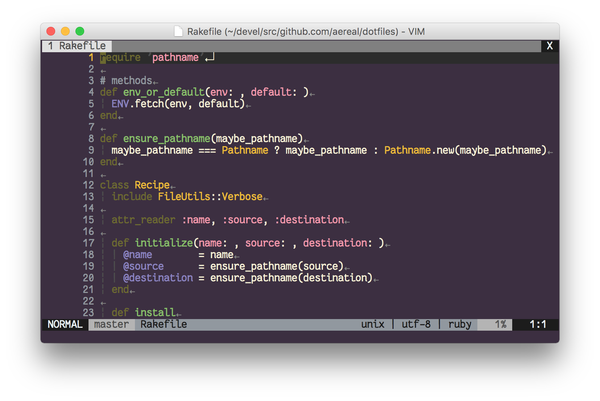
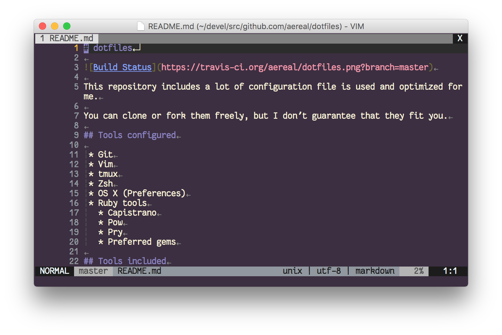

# vim-colors-japanesque

The colorscheme featuring Japanese traditional colors.

# Screenshots

Ruby:

Markdown:

## See also

* [Japanesque for iTerm](https://github.com/aereal/dotfiles/tree/master/colors/Japanesque)

## Author

aereal

## License

MIT License
